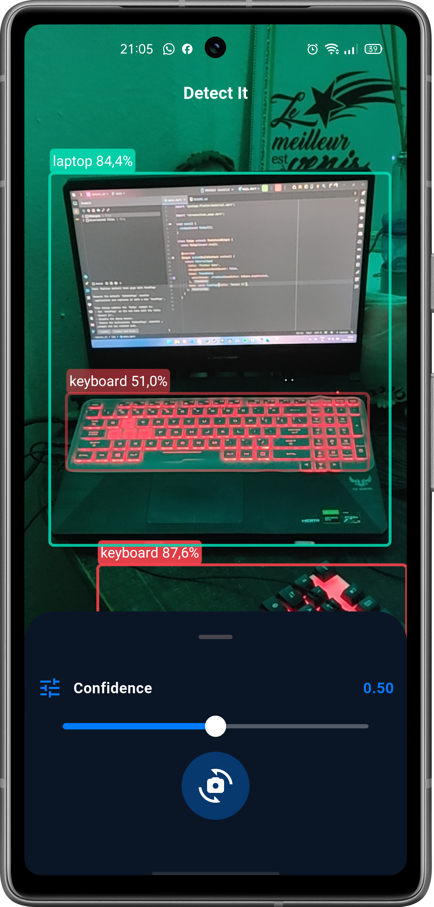

# Detect It

Real-time object detection Flutter app powered by **Ultralytics YOLO**.



## Requirements

- Flutter SDK (Dart **^3.10.4**)
- Android Studio / Android SDK (for Android builds)
- **JDK 17** (required by the Android/Gradle toolchain)

## Setup

1) Install dependencies:

```bash
flutter pub get
```

2) (Android) Make sure Java 17 is available.

- Set `JAVA_HOME` to your JDK 17 folder
- Ensure `%JAVA_HOME%\\bin` is in your `PATH`

## Run

```bash
flutter run
```

## Usage

- Use the bottom sheet slider to adjust the confidence threshold.
- Tap the camera switch button to swap between front/back cameras.
